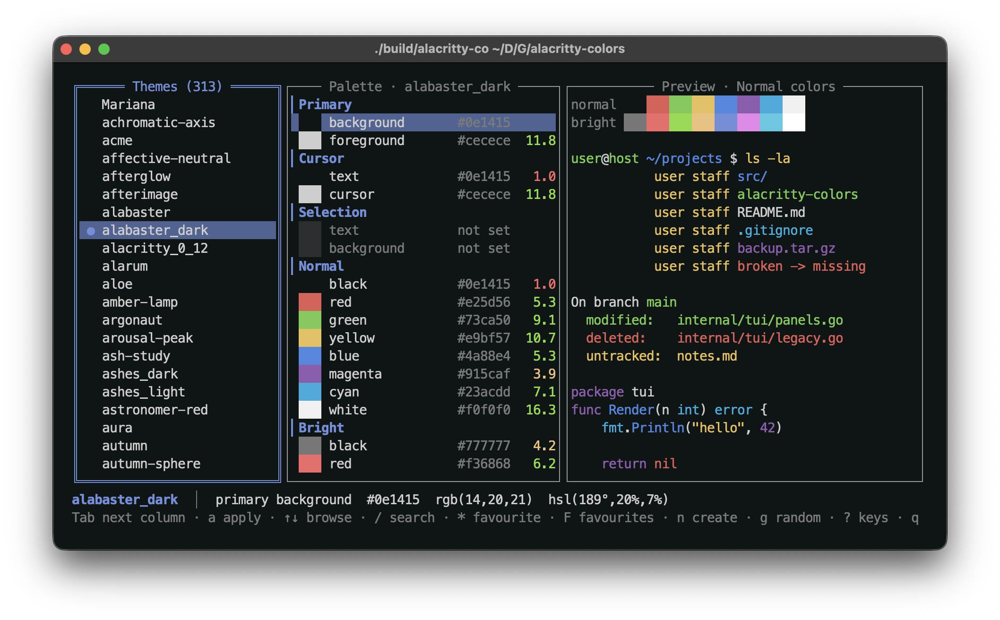
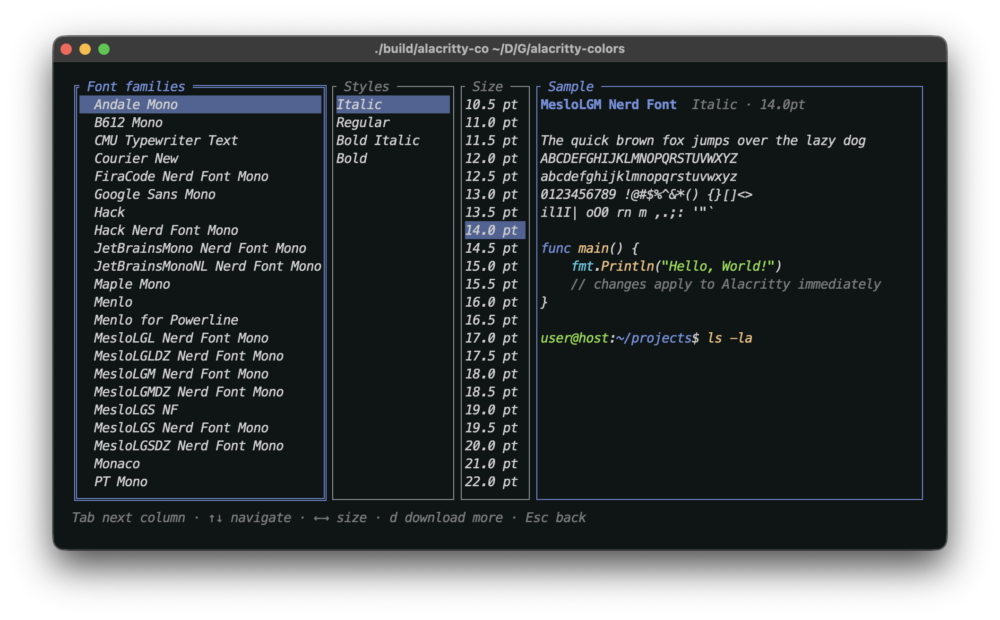

# Alacritty Colors

**An interactive Alacritty theme manager with comprehensive theme editing, font management, and seamless configuration capabilities.**

A command-line tool for managing Alacritty terminal themes, offering automatic downloads, custom theme generation, font configuration, and configuration management features.



*Browsing the library. Every theme applies to the terminal as the cursor rests on it, and each palette row carries its WCAG contrast ratio against the background.*


## Features

- **150 curated themes** - A designed collection: fifty grouped by mood, and a hundred grouped by the account of colour their structure comes from — Goethe, Itten, Hering, Kobayashi, Birren, scotopic vision, circadian light and more. Every one contrast-checked. See [the collection](#the-curated-collection).
- **Interactive TUI** - A terminal user interface for theme and font management.
- **Theme Management** - Apply, preview, and switch between available themes.
- **Theme Editing** - Edit theme colors directly within the TUI, with options for brightness and hue adjustments.
- **Theme Generation** - Create custom themes with color science-based harmonies (complementary, analogous, triadic, split-complementary, tetradic, monochromatic).
- **Random Theme Generator** - Generate random themes with WCAG-compliant contrast ratios.
- **Font Management** - Family, style and size, previewed live. Only fonts the terminal can actually resolve are offered, and sixteen popular monospace families can be downloaded and installed from inside the editor.
- **Auto-Download** - Automatically download themes from the official Alacritty repository.
- **Search & Favorites** - Find themes by name and mark favorites for quick access.
- **Backup & Restore** - Configuration management with automatic backups.
- **Cross-Platform** - Compatible with macOS, Linux, and Windows.
- **Efficient & Safe** - Designed to preserve your personal Alacritty settings.


## Quick Start

### Installation

**Using Go (recommended) **

```bash
go install github.com/vitruves/alacritty-colors/cmd/alacritty-colors@latest
```

**From Source:**

```bash
git clone https://github.com/vitruves/alacritty-colors.git
cd alacritty-colors
make build && make install
```

## Usage

Simply run `alacritty-colors` to launch the interactive TUI:

```bash
alacritty-colors
```

### Command Line Options

```bash
alacritty-colors [options]

Options:
  -config string    Path to alacritty.toml config file
  -themes string    Path to themes directory
  -export-collection dir
                    Write the 150 curated themes to a directory and exit
  -version          Show version information
  -help             Show help message

Examples:
  alacritty-colors                                    # Use default paths
  alacritty-colors -config /path/to/alacritty.toml   # Custom config
  alacritty-colors -themes /path/to/themes           # Custom themes dir
```

### Interactive TUI Keybindings

**Navigation**
- **Tab / Shift+Tab**: Cycle between the theme list, the palette and the preview
- **↑↓** or **j/k**: Move within a panel
- **PgUp / PgDn**: Jump ten rows — **Home / End**: first / last row
- **/**: Search themes as you type — fuzzy, so `ctpmoc` finds `catppuccin-mocha`
- **Esc**: Clear the search

**Theme management**
- **a**: Apply what you see immediately (browsing already applies as you go, and quitting keeps the one you landed on)
- **\***: Toggle favorite — **F**: show favorites only
- **e**: Fork the theme into an editable copy
- **d**: Delete a theme you created (downloaded themes are protected)
- **n**: Open the theme creator — **g**: generate a harmonious theme instantly
- **r**: Revert the theme to its saved version

**Color editing**
- **←→**: Brighten / darken the selected color
- **Shift+←→**: Rotate its hue
- **-** / **+**: Saturation — **[** / **]**: lightness
- **Enter** or **#**: Type an exact hex value
- **u**: Undo the selected color
- **s**: Save — **S**: save as…
- **c**: Cycle the preview color mode

**Panels & settings**
- **f**: Font settings — **p**: parameters (backup, reset, redownload)
- **?**: Full keyboard reference — **q**: quit

**Inside the font browser**
- **Tab**: Cycle family → style → size
- **↑↓**: Move within a column — **←→**: nudge the size from anywhere
- **d**: Download and install a monospace family (see below)
- **Esc**: Back to the editor

### Fonts

The browser lists families and styles taken from the same font database the terminal itself will use — Core Text on macOS, fontconfig elsewhere. This matters more than it sounds: `fc-list` is not what Alacritty consults on a Mac, and offering a name it reports but Core Text does not recognise is precisely what produces *unable to load font*. Nothing is listed that cannot be loaded.

Family, style and size all apply live, and writes are debounced, so scrolling a long list of families costs one write rather than one per row.

Press **d** for sixteen well-known monospace families — JetBrains Mono, Fira Code, Hack, Meslo, Iosevka, Victor Mono and others. They are fetched from the [Nerd Fonts](https://github.com/ryanoasis/nerd-fonts) release archive, so the powerline and icon glyphs a prompt expects are already patched in. Everything lands in your user font directory (`~/Library/Fonts`, or `~/.local/share/fonts` on Linux) — no administrator rights, nothing installed system-wide, and the browser reopens on the new list.



*The font browser. Families and styles come from the same database the terminal resolves against, so nothing listed can fail to load.*


### How editing treats your files

Edits are pushed to `themes/current.toml` only, so Alacritty repaints instantly and you judge colors at their true values in your own terminal. The theme file they came from is never touched until you save, and downloaded themes are never overwritten at all — saving one writes a copy under a new name. Writes are debounced, so holding an arrow key or scrolling through a long theme list does not hammer the disk.

Quitting commits: whatever is on screen stays applied, and any unsaved edits are written out on the way out rather than discarded. **a** does the same on demand, without the debounce.

Every palette row shows its WCAG contrast ratio against the theme background, and the preview grades the weakest color in the palette, which makes an unreadable theme obvious before you commit to it.

## The curated collection

**150 designed themes** ship with the tool and are installed on first run — press **p** → *Install the curated collection* to add or refresh them at any time. Each is built from a chosen background, text colour and accent; the sixteen ANSI slots are derived from that identity, so red stays red and blue stays distinct from cyan.

The first fifty are grouped by the mood their dominant hue is conventionally associated with. The hundred that follow are grouped instead by the named account of colour their structure comes from — Goethe, Itten, Hering, Kobayashi, Valdez & Mehrabian, Birren, scotopic vision, circadian light, Luscher, and the colour order systems of Munsell and Chevreul.

Naming a theory says where a palette's logic comes from; it is not an endorsement. Goethe was wrong about Newton, and Luscher's test does not measure what it claimed to. What each of them left behind is a coherent way of arranging colour, which is what a sixteen-slot palette actually needs.

**On "colour psychology":** colour–mood links are mostly cultural convention, and the experimental literature on them is thin and inconsistent. Two effects are better supported and are the ones actually leaned on here: short-wavelength (blue-ish) light suppresses melatonin and raises alertness, which is why the evening palettes pull blue out; and strong red in the visual field is associated with heightened arousal, which is why it is used as an accent rather than as a field. Everything else is a stated design intent, not a claim about your brain.

What is *not* a matter of taste: every palette is checked against WCAG contrast by the test suite — AAA for body text, AA for every ANSI colour against its background.

### Download the collection separately

The 150 `.toml` files are in **[`themes/collection/`](https://github.com/vitruves/alacritty-colors/tree/main/themes/collection)** — browse them there, or take the lot without installing anything:

```bash
# The whole collection, straight into Alacritty
curl -L https://github.com/vitruves/alacritty-colors/archive/refs/heads/main.tar.gz \
  | tar -xz --strip-components=3 -C ~/.config/alacritty/themes \
        alacritty-colors-main/themes/collection

# Or a single theme
curl -O --output-dir ~/.config/alacritty/themes \
  https://raw.githubusercontent.com/vitruves/alacritty-colors/main/themes/collection/purkinje-shift.toml
```

If you already have the binary, it will write them anywhere you like without going near your Alacritty config:

```bash
alacritty-colors -export-collection ./somewhere
```

Each file carries a `# alacritty-colors collection ·` header. That marker is how the tool knows a file is its own: it will refresh those on reinstall, and never overwrite one you have edited.

### Focus

Cool, low-chroma fields. Blue-leaning light is the one hue with a defensible link to alertness, so it anchors the working palettes.

| Theme | | |
|---|---|---|
| **Deep Current** | ● dark | Deep blue field for long sessions |
| **Cold Reason** | ● dark | Slate blue, cool and unhurried |
| **Blue Hour** | ● dark | Indigo of the minutes after sunset |
| **Still Water** | ● dark | Teal, quiet and even |
| **Glacier Mind** | ◐ light | Bright ice for daylight rooms |
| **Signal Clarity** | ● dark | Crisp cyan, everything legible at a glance |
| **North Study** | ● dark | Navy, steady and impersonal |
| **Quiet Harbor** | ● dark | Blue-grey with the volume down |
| **Meridian** | ● dark | Azure at its most exact |
| **Cobalt Discipline** | ● dark | Hard cobalt, little warmth |

### Calm

Green fields, the conventional colour of rest.

| Theme | | |
|---|---|---|
| **Forest Rest** | ● dark | Green depth, easy on a long afternoon |
| **Moss Hour** | ● dark | Olive and earth, softly lit |
| **Verdant Calm** | ● dark | Emerald, cool but alive |
| **Fern Light** | ◐ light | Pale green daylight |
| **Sage Counsel** | ● dark | Muted sage, nothing insistent |
| **Evergreen Watch** | ● dark | Pine at dusk |
| **Meadow Morning** | ◐ light | Warm green under early sun |
| **Jade Patience** | ● dark | Jade, cool and slow |
| **Cedar Quiet** | ● dark | Green over brown, wooden and low |
| **Aloe** | ◐ light | Mint on white, clean and cool |

### Warmth

Amber fields with the blue pulled down, for late hours.

| Theme | | |
|---|---|---|
| **Amber Lamp** | ● dark | Lamplight amber, low blue for evenings |
| **Hearth** | ● dark | Warm brown, close and settled |
| **Candle Study** | ● dark | Candlelit, deliberately short on blue |
| **Honeyed Dusk** | ● dark | Gold going down |
| **Terracotta Evening** | ● dark | Fired clay, warm and matte |
| **Parchment** | ◐ light | Aged paper, warm light theme |
| **Linen Morning** | ◐ light | Warm neutral, kind at 8am |
| **Toasted Oat** | ◐ light | Beige with body |
| **Copper Patina** | ● dark | Copper against oxidised teal |
| **Saffron Study** | ● dark | Saffron accent on dark spice |

### Energy

Red as accent, never as field — a large area of saturated red is tiring, a red signal on a dark ground is not.

| Theme | | |
|---|---|---|
| **Ember Drive** | ● dark | Red accent on near-black, for pushing through |
| **Redshift** | ● dark | Crimson, urgent and cold-edged |
| **Kiln** | ● dark | Orange-red at working heat |
| **Alarum** | ● dark | Maximum signal, minimum ambiguity |
| **Firebrand** | ● dark | Scarlet, unmistakably awake |

### Imagination

Violet and magenta, the conventional palette of novelty.

| Theme | | |
|---|---|---|
| **Violet Reverie** | ● dark | Violet field for wandering work |
| **Orchid Hour** | ● dark | Orchid, soft and strange |
| **Neon Reverie** | ● dark | Magenta turned up |
| **Mulberry Dusk** | ● dark | Deep berry, quieter than it looks |
| **Iris Bloom** | ◐ light | Violet on white paper |

### Neutral

Near-zero chroma, so nothing on screen competes for notice.

| Theme | | |
|---|---|---|
| **Graphite** | ● dark | Pure grey, no hue to argue with |
| **Slate Discipline** | ● dark | Grey with a trace of blue |
| **Paper Mind** | ◐ light | White page, black ink |
| **Ash Study** | ● dark | Warm ash, restrained |
| **Newsprint** | ◐ light | Off-white, low glare |

### Contrast

The practical end of the collection: legibility, and time of day.

| Theme | | |
|---|---|---|
| **High Noon** | ◐ light | Maximum legibility in a bright room |
| **Midnight Contrast** | ● dark | True black, maximum separation |
| **Soft Focus** | ● dark | Gentle on tired eyes, still above AA |
| **Nocturne** | ● dark | Blue pulled out for the last hours of the day |
| **Dawn Patrol** | ◐ light | Cool and bright, for starting early |

### Goethe

From *Zur Farbenlehre* (1810): his polarity of an active "plus" side, yellow through red, against a passive "minus" side of blue and violet, and the character he assigned to each hue.

| Theme | | |
|---|---|---|
| **Plus Side** | ● dark | The active pole, yellow through red |
| **Minus Side** | ● dark | The passive pole, blue and unhurried |
| **Turbid Medium** | ● dark | Colour as light seen through haze |
| **Vermilion Peak** | ● dark | The hue he thought most energetic |
| **Yellow Serene** | ● dark | Serene, gay, softly exciting |
| **Orange Powerful** | ● dark | Yellow-red, the energy raised a step |
| **Purple Grave** | ● dark | Gravity and dignity in one hue |
| **Green Contentment** | ● dark | Blue and yellow met, a real satisfaction |
| **Sulphur Anomaly** | ● dark | Yellow tipped just past pleasantness |
| **Steel Repose** | ● dark | The passive side at rest |

### Itten

The seven contrasts Johannes Itten taught at the Bauhaus, and the colour sphere that ordered them.

| Theme | | |
|---|---|---|
| **Cold Warm Divide** | ● dark | His cold-warm contrast, held in balance |
| **Light Dark Ladder** | ● dark | Contrast of value, nothing else |
| **Simultaneous Ghost** | ● dark | The colour an eye invents beside another |
| **Saturation Step** | ● dark | One hue, walked down in chroma |
| **Extension Ratio** | ● dark | Contrast of proportion, after Goethe |
| **Complement Tension** | ● dark | Opposites held apart |
| **Autumn Sphere** | ● dark | The warm, muted quarter of his sphere |
| **Winter Sphere** | ● dark | Cool and clear, the opposite quarter |
| **Spring Sphere** | ◐ light | Light and warm, on paper |
| **Summer Sphere** | ◐ light | Light and cool, on paper |

### Opponent

Hering's opponent-process account (1892) — the one piece of nineteenth-century colour theory modern vision science kept. Colour is coded on red–green, blue–yellow and black–white axes.

| Theme | | |
|---|---|---|
| **Opponent Channels** | ● dark | The three axes, given equal weight |
| **Red Green Axis** | ● dark | One axis pushed, the other quiet |
| **Blue Yellow Axis** | ● dark | The second axis takes the lead |
| **Achromatic Axis** | ● dark | Only the black-white channel left |
| **Unique Hues** | ● dark | The four hues that look mixed with nothing |
| **Afterimage** | ● dark | What the eye supplies when you look away |
| **Chromatic Cancel** | ● dark | Opposites cancelling towards grey |
| **Hering Balance** | ● dark | Neither axis allowed to win |
| **Opponent Night** | ● dark | The axes at low light |
| **Cardinal Direction** | ● dark | Four bearings on the colour plane |

### Image Scale

Kobayashi's Color Image Scale (1991), which placed palettes on a warm–cool and soft–hard plane and gave each region an image word.

| Theme | | |
|---|---|---|
| **Romantic Haze** | ◐ light | Soft and warm, the tender quarter |
| **Clear Field** | ◐ light | Cool and clean, nothing muddied |
| **Natural Ground** | ◐ light | Warm and soft, undyed |
| **Elegant Reserve** | ● dark | Cool, soft, and deliberately quiet |
| **Chic Monochrome** | ● dark | Hard and cool with the hue removed |
| **Dynamic Surge** | ● dark | Warm and hard, the loudest corner |
| **Modern Edge** | ● dark | Cool and hard, cleanly lit |
| **Classic Weight** | ● dark | Warm, deep, unhurried |
| **Casual Ease** | ◐ light | Mid-plane, nothing insisting |
| **Gorgeous Depth** | ● dark | Saturated and dark, the rich corner |

### Affect

Valdez and Mehrabian (1994) measured pleasure, arousal and dominance against colour and found brightness and saturation, not hue, did most of the predicting. These vary those two axes.

| Theme | | |
|---|---|---|
| **Pleasure Curve** | ● dark | Bright and moderately saturated |
| **Arousal Peak** | ● dark | Saturation taken as far as it reads |
| **Low Arousal** | ● dark | Chroma pulled down to almost nothing |
| **Bright Pleasure** | ◐ light | The brightest end of the scale |
| **Saturated Signal** | ● dark | High chroma on a dark ground |
| **Muted Submission** | ● dark | Low brightness, low chroma |
| **Valence Positive** | ● dark | Bright and green-leaning |
| **Affective Neutral** | ● dark | The middle of every axis |
| **Chroma Lift** | ● dark | Saturation raised, brightness held |
| **Luminance Lift** | ◐ light | Brightness raised, saturation held |

### Birren

Faber Birren's functional colour, written for factories and hospitals: colour chosen for the task rather than for the room.

| Theme | | |
|---|---|---|
| **Functional Blue Green** | ● dark | The hue he prescribed for sustained work |
| **Safety Green** | ● dark | The signal green of his colour codes |
| **Machinery Grey** | ● dark | The ground everything else sat against |
| **Focal Point** | ● dark | One warm accent to hold the eye |
| **Visual Rest** | ● dark | The colour to look at between tasks |
| **Colour Conditioning** | ● dark | His term for designing a room by its use |
| **Tint Tone Shade** | ● dark | His triangle, walked from tint to shade |
| **Institutional Calm** | ◐ light | The green of a room meant to settle you |
| **Task Light** | ◐ light | Warm light over the work surface |
| **Peripheral Quiet** | ● dark | Nothing at the edge of vision competing |

### Scotopic

In dim light the rods take over, sensitivity shifts towards blue (the Purkinje shift) and red all but disappears — which is why red light preserves dark adaptation.

| Theme | | |
|---|---|---|
| **Purkinje Shift** | ● dark | The blue-ward shift as light drops |
| **Rod Vision** | ● dark | What is left when the cones give up |
| **Scotopic Blue** | ● dark | Peak rod sensitivity, near 500 nanometres |
| **Mesopic Hour** | ● dark | Rods and cones both half working |
| **Dark Adaptation** | ● dark | Twenty minutes to full sensitivity |
| **Night Watch** | ● dark | Dim, cool, and steady for hours |
| **Red Preserve** | ● dark | Red light, because rods barely see it |
| **Astronomer Red** | ● dark | The observatory convention, kept dark |
| **Twilight Threshold** | ● dark | The minutes the shift happens in |
| **Cone Silence** | ● dark | Colour vision almost switched off |

### Circadian

Melanopsin in the retina responds most to short wavelengths. This is the best-supported effect in the whole collection: evening blue light delays melatonin, so the evening palettes take it out.

| Theme | | |
|---|---|---|
| **Melanopic Low** | ● dark | Short wavelengths pulled right out |
| **Melatonin Guard** | ● dark | Warm enough to leave the night alone |
| **Evening Filter** | ● dark | The last working hours, filtered |
| **Blue Suppressed** | ● dark | Amber throughout, by design |
| **Circadian Dusk** | ● dark | Warm and dimming, like the hour |
| **Late Shift** | ● dark | For the hours the body did not ask for |
| **Sunrise Signal** | ◐ light | Warm light on a bright ground |
| **Daylight Alert** | ◐ light | Short-wavelength rich, for the morning |
| **Zeitgeber** | ● dark | The cue that sets the clock |
| **Chronotype Owl** | ● dark | Built for whoever is up at two |

### Luscher

The eight test colours of 1947. The test does not measure personality and has not survived scrutiny — but the eight colours were chosen with care and still make a coherent set. That is the whole of the claim.

| Theme | | |
|---|---|---|
| **Deep Contentment** | ● dark | His dark blue, first of the eight |
| **Persistent Teal** | ● dark | Blue-green, the second |
| **Orange Desire** | ● dark | Orange-red, the third |
| **Yellow Aspiration** | ● dark | Bright yellow, the fourth |
| **Violet Identity** | ● dark | Violet, between red and blue |
| **Brown Comfort** | ● dark | Brown, the bodily one |
| **Black Renunciation** | ● dark | Black, the refusal |
| **Grey Detachment** | ● dark | Grey, standing outside the set |
| **Preference Order** | ● dark | The eight, ranked and read |
| **Eight Colour Test** | ● dark | The full set, taken as a palette |

### Colour Order

Munsell arranged colour by hue, value and chroma in perceptually even steps; Chevreul, at the Gobelins dye works, worked out that a colour is changed by whatever sits beside it.

| Theme | | |
|---|---|---|
| **Munsell Value Five** | ● dark | The middle rung of his value scale |
| **Chroma Neutral** | ● dark | Value and hue held, chroma near zero |
| **Hue Circle Ten** | ● dark | His ten principal hues, evenly spaced |
| **Chevreul Law** | ● dark | Simultaneous contrast, stated in 1839 |
| **Gobelins Grey** | ● dark | Where he found the effect, in the dye works |
| **Value Scale** | ◐ light | Nine steps from black to white |
| **Chroma Step** | ● dark | One hue, walked out from the axis |
| **Balanced Neutral** | ● dark | Equidistant from every hue |
| **Ordered System** | ● dark | Colour given three coordinates |
| **Colour Solid** | ● dark | The whole arrangement, in three dimensions |


## Configuration

Alacritty Colors automatically detects your configuration location:

**Default Locations:**

- **macOS/Linux**: `~/.config/alacritty/`
- **Windows**: `%APPDATA%/alacritty/`

**Directory Structure:**

```
~/.config/alacritty/
├── alacritty.toml           # Main config (with import line)
├── themes/
│   ├── current.toml         # Currently applied theme
│   ├── dracula.toml         # Downloaded/generated themes
│   ├── nord.toml
│   └── my-custom.toml
├── backups/                 # Automatic backups
│   ├── alacritty_2024-01-15_10-30-45.toml
│   └── alacritty_2024-01-16_14-22-10.toml
└── alacritty-colors.json    # Tool configuration
```

**Custom Paths:**
The application automatically handles paths.

## How It Works

Alacritty Colors uses a simple and safe approach:

1. **Import Line**: Adds `import = ["themes/current.toml"]` to your main config
2. **Theme Directory**: Stores all themes in a `themes/` subdirectory
3. **Current Theme**: Copies selected theme to `themes/current.toml`
4. **Preservation**: Your personal settings remain untouched in the main config

**Benefits:**

- Your personal settings are never modified
- Easy to disable (just remove the import line)
- Themes are portable and shareable
- No complex configuration file parsing required
- Clean separation between themes and personal config

## Theme Preview

The interactive TUI provides a real-time preview of the selected theme as you navigate and make changes.

## Theme Generation

Alacritty Colors includes a powerful theme generator that uses color theory to create harmonious color schemes:

**Color Harmonies Available:**
- **Complementary** - Opposite colors on the color wheel (180° apart)
- **Analogous** - Adjacent colors (30° apart) for a cohesive look
- **Triadic** - Three colors evenly spaced (120° apart)
- **Split-Complementary** - Base color plus two colors adjacent to its complement
- **Tetradic** - Four colors in a rectangle pattern (90° apart)
- **Monochromatic** - Single hue with varying saturation and lightness

**Theme Styles:**
- **Dark Mode** - Dark backgrounds with light foreground colors
- **Light Mode** - Light backgrounds with dark foreground colors

All generated themes maintain WCAG-compliant contrast ratios (minimum 4.5:1 for normal text, targeting 7.0:1 for optimal readability).

Press `n` to create a new theme or `g` to generate a random theme with harmony options.

## Troubleshooting

### Common Issues

**Themes not applying properly:**

- Reinitialize configuration (re-run `alacritty-colors` and ensure themes are downloaded).
- Check current theme status within the TUI.
- Verify import line exists in config (manual check of `~/.config/alacritty/alacritty.toml`).

**Permission errors:**

- Fix directory permissions:
  ```bash
  chmod 755 ~/.config/alacritty/
  chmod 644 ~/.config/alacritty/alacritty.toml
  ```
- Ensure themes directory is writable:
  ```bash
  chmod 755 ~/.config/alacritty/themes/
  ```

**Missing themes after update:**

- The application automatically handles theme updates during startup.
- Check themes directory: `ls -la ~/.config/alacritty/themes/`

**Configuration backup and restore:**

- Backups are automatically created by the application. You can manually manage them in `~/.config/alacritty/backups/`.
- To restore, you would typically replace your `alacritty.toml` with a backup.

### Getting Help

If you encounter issues:

1. Check this troubleshooting section
2. Look at existing [GitHub Issues](https://github.com/vitruves/alacritty-colors/issues)
3. Create a new issue with:
   - Your operating system and version
   - Alacritty version (`alacritty --version`)
   - Steps to reproduce the problem
   - Expected vs actual behavior

## License

MIT License - see [LICENSE](LICENSE) file for complete details.

## Acknowledgments

This project builds upon the excellent work of:

- **[Alacritty](https://github.com/alacritty/alacritty)** - The fast, cross-platform, OpenGL terminal emulator
- **[Alacritty Themes](https://github.com/alacritty/alacritty-theme)** - Official community theme collection
- **Color Theory Research** - HSL color space implementation for harmonious theme generation
- **Go Community** - For excellent tooling and libraries

## Related Projects

- **[Alacritty](https://github.com/alacritty/alacritty)** - The terminal emulator itself
- **[Alacritty Themes](https://github.com/alacritty/alacritty-theme)** - Official theme repository
- **[Base16](https://github.com/chriskempson/base16)** - Color scheme framework
- **[Pywal](https://github.com/dylanaraps/pywal)** - System-wide color scheme generation

---

**Made for terminal enthusiasts.**
